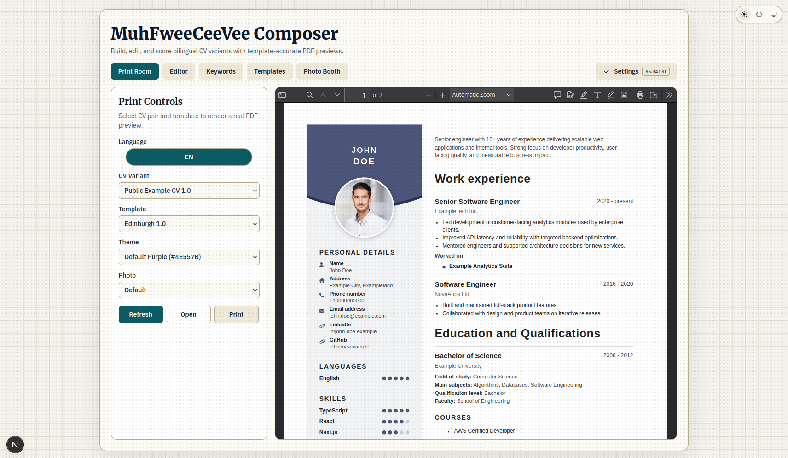
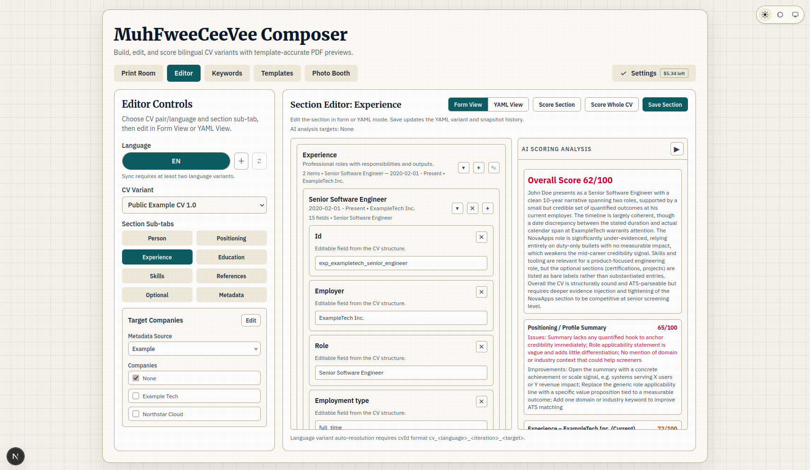
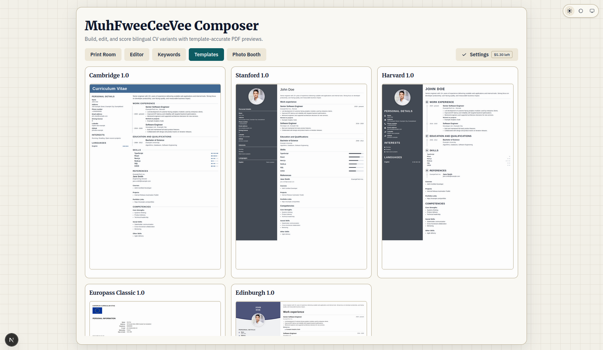
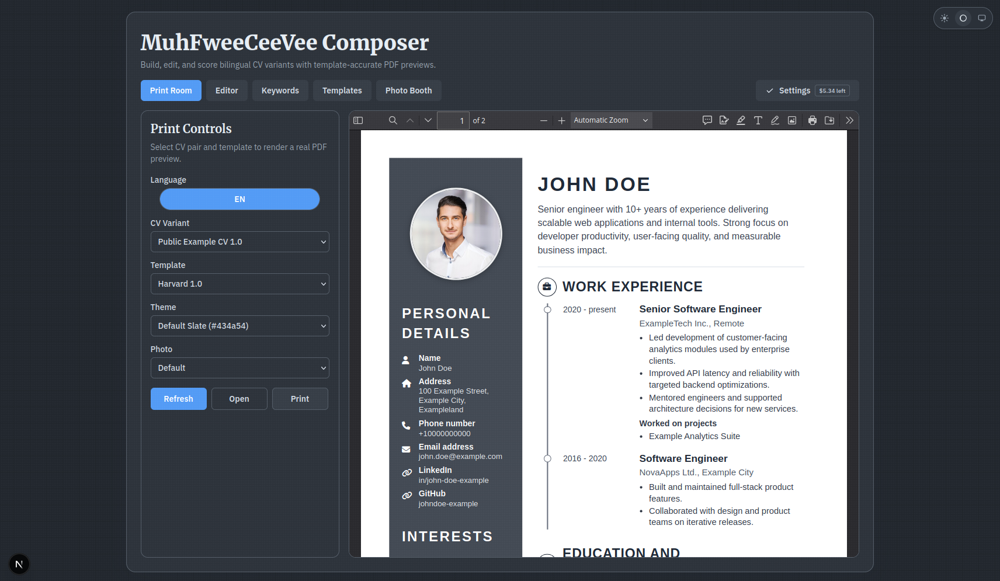
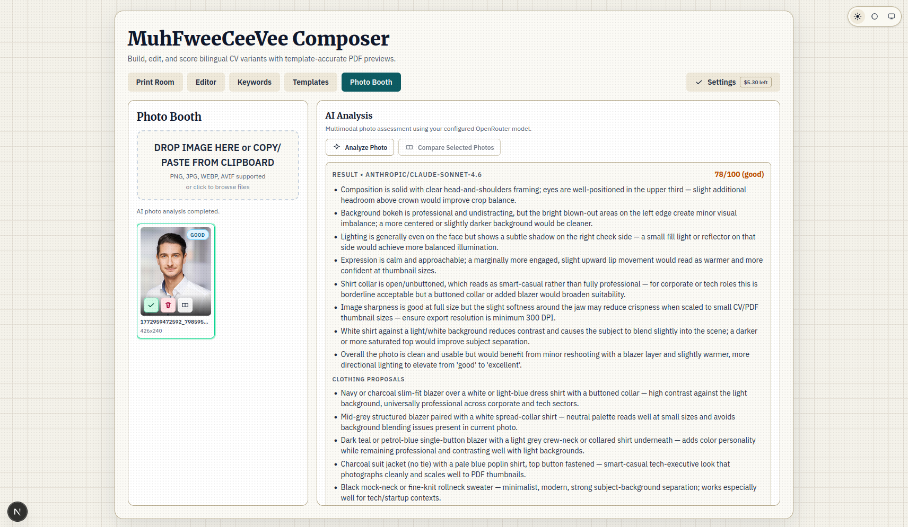

# MuhFweeCeeVee

*A self-hosted CV and job-search workspace you own instead of renting by the month.*

[](./package.json)
[](https://nodejs.org/)
[](./deploy/docker)
[](./LICENSE)

MuhFweeCeeVee brings CV writing, job research, cover letters, applications,
evidence, scoring, and print-ready export into one local workspace. It keeps the
source material under your control, supports local ATS checks alongside
optional AI help, and can preserve the exact documents submitted for each job.

<p align="center">
  
</p>

## What's New in 1.4.0

This update makes the workspace feel much more like one place to do the whole job search, not a collection of disconnected tools.

- **A much richer AI workspace.** Choose the provider and model behind each job, connect Codex or xAI when you want OAuth instead of an API key, see usage limits and cost estimates, and use the same setup for translation, research, CV review, photo feedback, and writing help.
- **A deeper CV editing and review loop.** Rate skills in half-steps, keep ATS and writing-review results with the CV, inspect AI-detection findings by section, add or remove experience subsections, preserve hidden fields in YAML, and work in a clearer light or dark editor.
- **A real application trail.** Organize each application across its details, company, snapshots, and timeline; schedule the next action, keep contacts and activity together, save reusable evidence, and freeze the exact materials you submitted.
- **More confidence at the finish line.** Print Room keeps revisions in sensible version order, remembers print choices, offers conservative pagination help, and carries useful document details into exported PDFs. Letters, photos, and application controls also got a broad usability pass.
- **A copilot that stays in your hands.** MuhFwee AI can read the current workspace, show what it is doing, and ask before it changes a CV, research record, letter, or application.

See the [changelog](./CHANGELOG.md) for the full 1.4.0 story.

## What You Can Do

- **Write one CV in the view you prefer.** Move between structured forms and YAML without maintaining two separate documents.
- **See the real output while editing.** Preview and print template-accurate PDFs in Cambridge, Stanford, Harvard, Europass, and Edinburgh styles.
- **Tailor and check for a specific job.** Extract weighted keywords, show the
  gaps in the Editor, and run a local ATS check before spending AI credits.
- **Create cover letters with context.** Bind each letter to a CV and target, keep version history, and run a separate humanizer pass.
- **Manage the full application trail.** Track stages, next actions, contacts,
  activity, and analytics, then freeze the exact submitted files as one packet.
- **Build a reusable evidence library.** Keep verified achievements and link them to the CV claims they support.
- **Ask the built-in copilot for help.** Review visible tool activity and approve every proposed CV, Research, letter, or application change at field level.
- **Back up the workspace.** Export a merge-restorable ZIP with structured records, referenced photos, evidence, submissions, and optional PDFs.

<p align="center">
  
  
</p>

## A Practical Workflow

1. Add your master CV in **Editor** using forms or YAML.
2. Save the company and role in **Research**, then extract the job's keywords.
3. Target that role from the CV and review the keyword gap and ATS check.
4. Draft and humanize a cover letter tied to the same CV and target.
5. Build the application in **Board** and generate the final PDF in **Print Room**.
6. When you apply, freeze the complete submission packet and set the next action.

AI is optional. Local editing, templates, keyword extraction, ATS checks, board
operations, and backups remain useful without an external model.

## Templates and Print

Print Room renders the actual PDF inside the app. Per CV, template, and language,
it remembers presentation tweaks such as text scale, photo mode, and column
balance.

<p align="center">
  
  
</p>

## Data, Privacy, and AI

CVs, application data, photos, and settings stay on the host you control.
Private MuhFwee AI conversations and playbooks are excluded from backups by
default. If explicitly included, conversation history is redacted and restored
as archived history so old approvals cannot run.

External AI or research features send the relevant job, company, or CV context
to the provider you configure. Review that provider's privacy terms before
using sensitive personal data.

When the app is reachable beyond localhost, set `MFCV_API_TOKEN`. Non-loopback
mutation, analysis, and export requests are denied without the token. Put a TLS
reverse proxy such as Caddy or nginx in front of any remote deployment.

## Quick Start

Requirements: Node.js 22 or newer and npm 10 or newer.

```bash
npm run bootstrap
npx playwright install chromium
npm run dev:windows:start
```

Open `http://127.0.0.1:10004`. On other platforms, use `npm run dev`; the
production app defaults to port `3000`.

## Docker Compose

```bash
cp deploy/docker/compose.env.example .env.docker
# Set a long, random MFCV_API_TOKEN in .env.docker.
docker compose --env-file .env.docker up --build -d
docker compose --env-file .env.docker ps
```

Open `http://127.0.0.1:3000` and check `/api/health`. Keep `.env.docker` local.
`docker compose down` preserves named volumes; adding `--volumes` deliberately
erases container-managed CV, photo, and runtime configuration data.

## Development

```bash
npm run lint
npm run typecheck
npm test
npm run build
```

- [Documentation index](./docs/DOCUMENTATION_INDEX.md)
- [CV YAML standard](./docs/CV_YAML_STANDARD.md)
- [CV scoring standard](./docs/CV_SCORING_STANDARD.md)
- [API reference](./docs/API.md)
- [Contributor guide](./CONTRIBUTING.md)

MuhFweeCeeVee is available under the [MIT License](./LICENSE).
