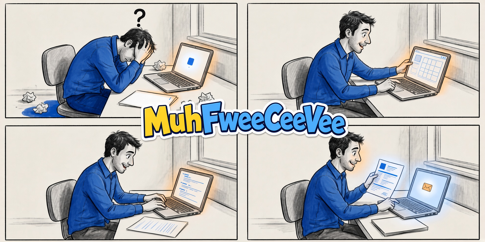

# MuhFweeCeeVee

*A self-hosted CV and job-search workspace you own instead of renting by the month.*

[](./package.json)
[](https://nodejs.org/)
[](./deploy/docker)
[](./LICENSE)

MuhFweeCeeVee is a local workspace for CVs, job research, cover letters, applications, evidence, scoring, and print-ready export. Source files stay on the host you control. Local ATS checks run without a model. Optional AI help is per job, and submitted packets can be frozen as sent.


<p align="center">
  
</p>

<p align="center">
  
</p>

## What’s New in 1.4.0

- **Per-job AI providers.** Pick which service and model handles a given job. Codex signs in with a weekly quota; xAI uses device login and reasoning levels. Hosted and local endpoints both work. Limits and a rough cost show before a large request.
- **Copilot with approval.** MuhFwee AI can read the current workspace, show its steps, and wait before it edits a CV, research record, letter, or application. Conversations can be archived or saved as playbooks.
- **Application trail and backups.** Each application keeps details, contacts, next actions, and a freeze of what you sent. Workspace backups export records, photos, evidence, and submissions, then merge on restore.
- **Editor and Print Room.** Half-step skill ratings. ATS and writing-review findings stay on the CV (findings, not a fake score). Hidden YAML fields and experience subsections are editable. Clone versions; Print Room orders them newest first and remembers print choices.

See the full [changelog](./CHANGELOG.md).

## What You Can Do

- **One CV, two views.** Move between structured forms and YAML without keeping two documents.
- **Job-specific tailoring.** Extract weighted keywords, show the gaps, and run a local ATS check before you spend AI credits.
- **Letters and applications.** Bind a letter to a CV and target, keep version history, and run humanizing as its own pass. Track stages, contacts, and next actions, then freeze the packet you submitted.
- **Evidence and backups.** Keep verified achievements next to the CV claims they support. Export a merge-restorable ZIP of records, photos, evidence, submissions, and optional PDFs.
- **Copilot.** Review visible tool activity and approve proposed CV, research, letter, or application edits at field level.

<p align="center">
  
  
</p>

## Workflow

1. Add your master CV in **Editor** using forms or YAML.
2. Save the company and role in **Research**, then extract the job's keywords.
3. Target that role from the CV and review the keyword gap and ATS check.
4. Draft and humanize a cover letter tied to the same CV and target.
5. Build the application in **Applications** and generate the final PDF in **Print Room**.
6. When you apply, freeze the complete submission packet and set the next action.

AI is optional. Local editing, templates, keyword extraction, ATS checks, board operations, and backups work without an external model.

## Templates and Print

Print Room renders the actual PDF inside the app. Cambridge, Stanford, Harvard, Europass, and Edinburgh styles are available. Per CV, template, and language, it remembers text scale, photo mode, and column balance.


<p align="center">
  
  
</p>

## Data, Privacy, and AI

CVs, application data, photos, and settings stay on the host you control.
Private MuhFwee AI conversations and playbooks are excluded from backups by
default. If explicitly included, conversation history is redacted and restored
as archived history so old approvals cannot run.

External AI or research features send the relevant job, company, or CV context
to the provider you configure. Review that provider's privacy terms before
using sensitive personal data.

When the app is reachable beyond localhost, set `MFCV_API_TOKEN`. Non-loopback
mutation, analysis, and export requests are denied without the token. Put a TLS
reverse proxy such as Caddy or nginx in front of any remote deployment.

## Quick Start

Requirements: Node.js 22 or newer and npm 10 or newer.

```bash
npm run bootstrap
npx playwright install chromium
npm run dev:windows:start
```

Open `http://127.0.0.1:10004`. On other platforms, use `npm run dev`; the
production app defaults to port `3000`.

## Installation

Docker Compose is the packaged local install:


```bash
cp deploy/docker/compose.env.example .env.docker
# Set a long, random MFCV_API_TOKEN in .env.docker.
docker compose --env-file .env.docker up --build -d
docker compose --env-file .env.docker ps
```

Open `http://127.0.0.1:3000` and check `/api/health`. Keep `.env.docker` local.
`docker compose down` preserves named volumes; adding `--volumes` deliberately
erases container-managed CV, photo, and runtime configuration data.

## Documentation

```bash
npm run lint
npm run typecheck
npm test
npm run build
```

- [Documentation index](./docs/DOCUMENTATION_INDEX.md)
- [CV YAML standard](./docs/CV_YAML_STANDARD.md)
- [CV scoring standard](./docs/CV_SCORING_STANDARD.md)
- [AI copilot panel](./docs/AI_COPILOT_PANEL.md)
- [API reference](./docs/API.md)
- [Research / LinkedIn libraries](./docs/RESEARCH_LINKEDIN_LIBRARIES.md)
- [Contributor guide](./CONTRIBUTING.md)


## Support

Support, feedback, and feature ideas: [@ApoMakesMods](https://x.com/ApoMakesMods) on X.

## License

MuhFweeCeeVee is available under the [MIT License](./LICENSE).
