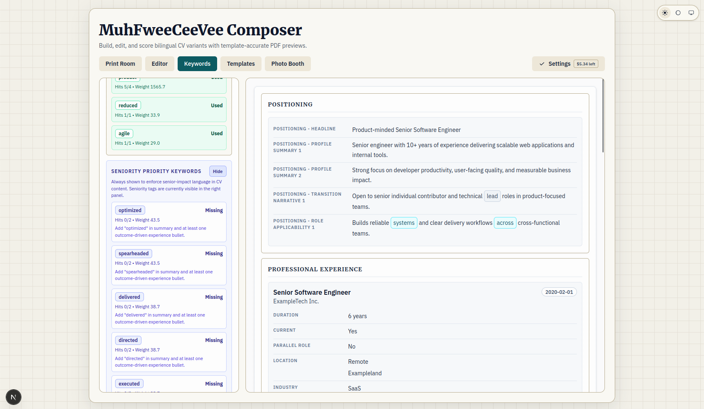

# MuhFweeCeeVee

MuhFweeCeeVee started as a practical “enough is enough” project: paying recurring CV-tool subscriptions for features that can be built and customized in a few focused days did not make sense anymore.

The core goal is simple:

- save roughly **$15-$20 per month** (or more) versus common CV SaaS plans
- keep full control of your data and workflow
- quickly customize the product to fit your own job-search style

In short: why rent your resume workflow forever, when you can own it and make it **fwee**.

## Why This Exists (Cost Comparison)

| Service | Typical Paid Cost | Paid Features | Vs MuhFweeCeeVee |
| --- | ---: | --- | --- |
| Resume.io | $29.95 / 4 weeks (after $2.95 7-day trial) | Resume builder, cover letters, templates, PDF downloads | MuhFweeCeeVee has local-first CV editing/export + cover letters with **humanizer** skill |
| Kickresume | $24/mo monthly, $18/mo quarterly, $8/mo yearly | Resume + cover letter templates, ATS checker, AI writer | MuhFweeCeeVee has AI analysis, deterministic ATS check, and humanized cover-letter drafts |
| VisualCV | $16/mo billed quarterly | Resume templates, unlimited resumes, PDFs, share links, website profile | MuhFweeCeeVee has customizable local workflow; public profile website flow is **Coming Soon** |
| Teal+ | $13/week | Resume builder, keyword matching, job tracking, AI credits | MuhFweeCeeVee has Research job keywords + Editor targeting + Apps tracker |
| **MuhFweeCeeVee** | **fwee** | Local self-hosted CV composer, templates, PDF export, AI scoring, Research catalog, Letters/Apps, product AI skills | Owned + customized; cover letters use **ai-skills/humanizer** |

## Features

### 1) Print, preview, and theme confidence

Use Print Room to configure template-based rendering (`cambridge-v1`, `stanford-v1`, `harvard-v1`, `europass-v1`, `edinburgh-v1`) and immediately validate readability in both light and dark visual modes before export. This is the print-ready PDF export path.

<p align="center">
  
  
</p>

### 2) Edit precision + job-fit diagnostics

Combine Form + YAML editing with AI scoring and **Research** job targeting (pick a researched company + job; weighted keywords highlight in the Editor). Product direction: one company/job list in Research — see [`proposal/`](proposal/).

<p align="center">
  
  
</p>

### 3) Presentation polish and profile quality

Review available CV templates side-by-side, then finalize profile-photo quality using Photo Booth analysis and recommendations as part of the full self-hosted CV authoring workflow.

<p align="center">
  
  
</p>

## 1.0.2 Release Scope

Version `1.0.2` is the current public release with a stable user-facing workflow:

- Print Room (preview + export)
- Editor (Form/YAML)
- Editor Form View includes collapsible nested containers (collapsed by default for deep structures) with compact summary metadata for faster navigation.
- Experience entries in Form View are labeled with role-first titles and period/company subtitles instead of generic numbered labels.
- Settings (OpenRouter login, Analysis Model, Image Generation Model for future use, base URL, credit status, and per-check cost estimates)
- **Research** tab: local catalog of companies + job positions, weighted keywords, field AI (see roadmap in `proposal/`)
- Editor job targeting from Research (keyword highlight); legacy company-metadata multi-select is being retired (D1)
- Dynamic language variants in Editor (add language + optional AI translation)
- Variant auto-resolution supports both id styles:
  `cv_<language>_<target>` and `cv_<language>_<iteration>_<target>`.
- Language sync modal in Editor (pick source/target language pair with timestamp visibility)
- Theme support (light/dark/system + template themes)
- Print Room photo customization modes (default/circle/square/original-ratio/off)
- Public fictional sample profile (`John Doe`)
- Privacy hardening for local/private artifacts (personal CVs, research catalog, photos) to keep them out of git by default

**Note:** The old **Keyword Studio** tab and sqlite JD corpus were retired to `backup/retired-keywords/`. Keywords now live on **Research → job positions**.

## Repository Layout

- `apps/web/`: Next.js web application
- `ai-skills/`: **product** AI skills injected at runtime (e.g. `humanizer` on cover letters) — not agent-dev skills
- `skills/patterns/`: agent/dev workflow skills for contributors
- `services/parser/`: FastAPI parser service scaffold
- `packages/schemas/`: shared schema/constants
- `packages/render-core/`: shared rendering primitives
- `data/`: sample CV and template mapping data
- `templates/`: template definitions and assets
- `deploy/systemd/`, `deploy/nginx/`: Linux deployment references

## Documentation for Contributors and Agents

Process templates (adapted from shared defaults), checklists, and product specs:

- [`docs/DOCUMENTATION_INDEX.md`](docs/DOCUMENTATION_INDEX.md) — full index
- [`AGENTS.md`](AGENTS.md) — AI development operating contract
- [`CONTRIBUTING.md`](CONTRIBUTING.md) — human contributor quick start

## Prerequisites

- Node.js `>= 22`
- npm `>= 10`
- Python `3.12.x` (for parser service)

## Quick Start (Local)

```bash
npm run bootstrap
npm run dev
```

Optional parser service (second terminal; **scaffold only**, see
[`services/parser/README.md`](services/parser/README.md)):

```bash
npm run dev:parser
```

When exposing the app beyond localhost, set `MFCV_API_TOKEN` in `.env`. Non-loopback
clients must send it as `Authorization: Bearer …` or `x-mfcv-api-token` on
mutation/analysis/export routes. The local browser UI on `localhost` stays trusted
without embedding the secret. Production non-loopback access without a token is denied.

Nginx example (snippet):

```nginx
location /api/ {
  proxy_pass http://127.0.0.1:3000/api/;
  # Prefer terminating TLS here; do not strip Authorization.
  proxy_set_header Host $host;
  proxy_set_header Authorization $http_authorization;
  proxy_set_header x-mfcv-api-token $http_x_mfcv_api_token;
}
```

Optional: `MFCV_REQUIRE_API_TOKEN=true` fails closed if the token is missing.
Live research integration tests: `RUN_LIVE_RESEARCH=1` (never set in CI).

Quality checks:

```bash
npm run lint
npm run typecheck
```

## Roadmap / proposals

- [`proposal/FEATURE_BACKLOG_AND_RESEARCH_HARDENING.md`](proposal/FEATURE_BACKLOG_AND_RESEARCH_HARDENING.md) — product direction
- [`proposal/IMPLEMENTATION_PLAN.md`](proposal/IMPLEMENTATION_PLAN.md) — workstreams (D1–D5 locked)
- [`proposal/PROGRESS.md`](proposal/PROGRESS.md) — checkbox progress

## Production Build

```bash
npm run bootstrap
npm run build
npm run start
```

Default web runtime port is `3000` unless overridden by environment.

## Hosting Guide

### Windows 11

Recommended stack:

- app process: Node.js (`npm run build && npm run start`)
- optional parser process: Python `uvicorn`
- reverse proxy / TLS: Caddy (recommended) or IIS reverse proxy

Steps:

1. Install Node.js 22+ and Python 3.12.
2. Clone repo and run `npm run bootstrap`.
3. Build web: `npm run build`.
4. Run web as background service using NSSM or Windows Task Scheduler:
   - program: `npm`
   - args: `run start`
   - working dir: repo root
5. (Optional) run parser service with its own NSSM entry:
   - `cd services/parser`
   - `python -m venv .venv`
   - `.venv\Scripts\pip install -r requirements.txt`
   - `.venv\Scripts\uvicorn main:app --host 127.0.0.1 --port 8001`
6. Configure Caddy/IIS to proxy HTTPS traffic to `127.0.0.1:3000`.

### Linux (Ubuntu/Debian/RHEL)

Recommended stack:

- app process: systemd service for Next.js
- optional parser process: systemd service for FastAPI
- reverse proxy / TLS: nginx or Caddy

Steps:

1. Install Node.js 22+, npm 10+, Python 3.12.
2. Clone repo and run `npm run bootstrap`.
3. Build web: `npm run build`.
4. Create systemd unit for web process (`npm run start`).
5. (Optional) create parser venv and systemd unit for uvicorn on `127.0.0.1:8001`.
6. Configure nginx/Caddy reverse proxy and HTTPS certs.
7. Enable auto-start:
   - `sudo systemctl enable --now <web-service>`
   - `sudo systemctl enable --now <parser-service>` (if used)

### macOS

Recommended stack:

- app process: Node.js (`npm run build && npm run start`)
- optional parser process: Python `uvicorn`
- service manager: `launchd` (LaunchAgent/LaunchDaemon)
- reverse proxy / TLS: Caddy or nginx

Steps:

1. Install Node.js 22+ and Python 3.12 (Homebrew recommended).
2. Clone repo and run `npm run bootstrap`.
3. Build web: `npm run build`.
4. Create `launchd` plist for `npm run start` in repo root.
5. (Optional) create parser `launchd` plist for uvicorn on `127.0.0.1:8001`.
6. Configure Caddy/nginx to expose HTTPS and proxy to `127.0.0.1:3000`.

## Runtime Data and Privacy

- Public repo includes only fictional sample CV data.
- Personal/local CV history and planning artifacts are intentionally untracked.
- Keep real CV content in local/private files outside version control.
- OpenRouter key is stored in local `.env` as `OPENROUTER_API_KEY` when saved via UI.

## Release and Changelog

- Changelog is the source of truth for release notes:
  - [`CHANGELOG.md`](CHANGELOG.md)
- Changelog governance and writing style:
  - [`CHANGELOG_GUIDE.md`](dev/CHANGELOG_GUIDE.md)
- API reference (including post-1.0.0 additions):
  - [`docs/API.md`](docs/API.md)
- MCP wrapper guide:
  - [`MCP.md`](dev/MCP.md)

## Documentation Map

| File | Purpose |
|------|---------|
| [`README.md`](README.md) | Project overview, features, quick start, hosting guide |
| [`CHANGELOG.md`](CHANGELOG.md) | Release history (user-facing changes) |
| [`CHANGELOG_GUIDE.md`](dev/CHANGELOG_GUIDE.md) | Changelog rules, overwrite-first principle, writing style |
| [`CONTRIBUTING.md`](CONTRIBUTING.md) | Contribution guide |
| [`SECURITY.md`](dev/SECURITY.md) | Security policy, privacy hardening, secret handling |
| [`AGENTS.md`](AGENTS.md) | AI-assisted development operating contract (local, gitignored) |
| [`DEVELOPMENT_PLAN.md`](dev/DEVELOPMENT_PLAN.md) | Forward-looking plan (local, gitignored) |
| [`DEVELOPMENT_LOG.md`](dev/DEVELOPMENT_LOG.md) | Engineering journal (local, gitignored) |
| [`TODO.md`](TODO.md) | Active work queue (local, gitignored) |
| [`TODO_TEMPLATE.md`](dev/TODO_TEMPLATE.md) | TODO structure template reference |
| [`CODE_REVIEW_CHECKLIST.md`](dev/CODE_REVIEW_CHECKLIST.md) | Code review checklist for AI and human reviews |
| [`RELEASE_CHECKLIST.md`](dev/RELEASE_CHECKLIST.md) | Preflight and publish checklist |
| [`DECISION_RECORD_TEMPLATE.md`](dev/DECISION_RECORD_TEMPLATE.md) | Architecture decision record template |
| [`DEV_SERVER_WORKFLOW.md`](dev/DEV_SERVER_WORKFLOW.md) | Dev server lifecycle (Next.js + parser) |
| [`GENERATED_FILES.md`](dev/GENERATED_FILES.md) | Generated file rules and staleness detection |
| [`HARD_PROBLEMS.md`](dev/HARD_PROBLEMS.md) | Record of recurring blockers and resolutions |
| [`SELF_REVIEW.md`](dev/SELF_REVIEW.md) | Running journal of mistaken approaches and better defaults |
| [`VIBECHECK.md`](dev/VIBECHECK.md) | Developer interaction profile (local, AI-owned) |
| [`AGENT_ISSUES.md`](dev/AGENT_ISSUES.md) | Agent/subagent failure records |
| [`SKILLS_GUIDE.md`](dev/SKILLS_GUIDE.md) | Skill mining and management guide |
| [`PROJECT_CONVENTIONS.md`](dev/PROJECT_CONVENTIONS.md) | Naming, directory, and structural conventions |
| [`MARKDOWN_LINT.md`](dev/MARKDOWN_LINT.md) | Markdown lint configuration and rules |
| [`.markdownlint.json`](.markdownlint.json) | Markdown lint rule config |
| [`docs/API.md`](docs/API.md) | Web API reference |
| [`proposal/`](proposal/) | Research hardening backlog, implementation plan, progress |
| [`docs/CV_SCORING_STANDARD.md`](docs/CV_SCORING_STANDARD.md) | CV scoring rubric and quality checks |
| [`docs/CV_YAML_STANDARD.md`](docs/CV_YAML_STANDARD.md) | CV YAML schema and validation rules |
| [`docs/INITIAL_TEMPLATING_BOOTSTRAP.md`](docs/INITIAL_TEMPLATING_BOOTSTRAP.md) | Initial template implementation notes |
| [`MCP.md`](dev/MCP.md) | MCP wrapper usage guide |

## License

This project is licensed under the MIT License. See [`LICENSE`](LICENSE).
Template-specific license metadata lives under each template folder.
