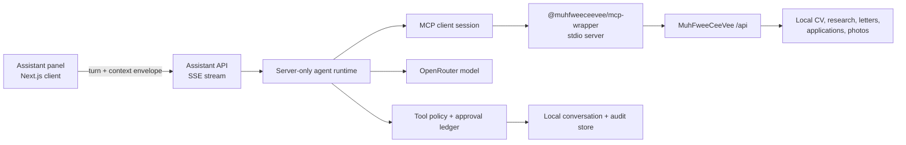

# Internal AI Copilot Panel

Status: product specification and implementation backlog  
Working name: **MuhFwee AI**  
Primary surface: global lower-right launcher and docked assistant panel

## Product brief

- **User:** a power user managing many CV variants, targets, letters, photos,
  and applications. They understand their job-search data but should not need
  to remember which screen or tool performs each operation.
- **Job:** “Help me understand and manage this job-search workspace without
  losing the application, CV, or target I am working on.”
- **Current behavior:** AI actions are distributed across Editor, Research,
  Letters, Photo Booth, and external MCP clients. There is no single surface
  that understands the current selection and can coordinate the full workflow.
- **Desired outcome:** a context-aware assistant can explain the workspace,
  retrieve details, propose a plan, and execute confirmed operations through
  the same MCP tool catalog used by external agents.
- **Success signals:** fewer panel switches for multi-step work; users can
  inspect every tool call; no mutation occurs without the required approval;
  the selected CV/job/application remains stable when the assistant opens and
  closes.
- **Non-goals:** an unsupervised job-application bot, web browsing outside
  existing research tools, credential entry in chat, automatic sending of
  applications or messages, and silent background mutation.
- **Object:** an assistant conversation scoped to a MuhFweeCeeVee workspace.
- **Action, scope, consequence:** reads may run automatically; mutations name
  the exact records affected and require approval; destructive actions and
  paid research receive stronger confirmation. Tool results remain local.
- **Permissions:** the local authenticated user can open the panel. The server
  enforces MCP/API authorization and action policy independently of the model.
  Without an AI model or MCP connection, the panel becomes a diagnostic,
  read-only surface with recovery instructions.
- **Open decisions:** whether conversation history is included in portable ZIP
  backup by default, and whether a later release supports reusable playbooks.

This brief satisfies the material-decision requirement in
`rule/smallest-intervention`.

## Product decision

Build a persistent docked copilot rather than a centered chat modal. The user
must retain sight of the active CV, job, letter, or application while asking
for help. The launcher opens an adjacent surface without changing the active
panel or resetting drafts (`rule/inline-before-modal`,
`rule/preserve-mental-model`).

The assistant is not trusted to authorize itself. A deterministic policy layer
classifies every MCP tool call before execution:

- read-only tools can run and show their result;
- local mutations require an approval card naming object and scope;
- destructive operations require a consequence-specific confirmation;
- credit-consuming research or analysis shows an estimate before execution;
- credential, backup-import, and unsupported external-send operations are
  blocked from the agent loop in the first release.

This separation applies `rule/name-object-scope-consequence` and
`rule/destructive-proportional`.

## Entry point and layout

### Launcher

- A circular button sits inside the lower-right safe area of the application
  shell, above browser and mobile safe-area insets.
- It has the accessible name **Open MuhFwee AI** and a visible tooltip
  (`rule/accessible-name-required`).
- It does not move when the active composer panel changes.
- `Ctrl+/` toggles the panel. Escape closes it and focus returns to the
  launcher (`rule/keyboard-complete-flow`).
- The button may show one status treatment at a time:
  idle, working, approval needed, unread result, or disconnected.
- Status cannot rely on color alone.

The launcher is one action and therefore remains a button rather than a menu
(`rule/navigation-vs-action`).

### Desktop panel

- Dock to the right edge of the composer shell.
- Default width: approximately 440 px, resizable between 360 and 640 px.
- Keep the underlying application usable; opening the assistant is not a
  blocking decision.
- Remember width and open/closed state locally.
- Never cover the main navigation or the active panel’s primary action.

### Compact layout

- On narrow screens, open as a full-height sheet with a clear Close action.
- Do not stack an assistant sheet over an existing modal. Close or defer the
  assistant before a composer modal opens (`rule/no-nested-modals`).
- Preserve the conversation and draft message when switching layouts
  (`rule/preserve-user-input`).

## Information architecture

The panel has four stable regions:

1. **Header**
   - assistant name and connection state;
   - current context chip;
   - New conversation and Close actions.
2. **Conversation**
   - user and assistant messages;
   - plans, tool activity, approval cards, results, and errors in chronological
     order.
3. **Context drawer**
   - active panel;
   - selected CV, language, template, company, job, letter, application, and
     approved photo when available;
   - included, stale, or unavailable status for each context item.
4. **Composer**
   - multiline prompt;
   - Send as the one primary action;
   - contextual suggestions only before the first message.

Use hierarchy before additional cards or nested containers
(`rule/structure-before-containers`, `rule/one-primary-action`).

## Context model

“Full management context” does not mean placing every private record into every
model request. It means the assistant knows what exists and can retrieve the
minimum required detail through MCP.

### Context envelope

The browser sends a small, explicit envelope with each turn:

```json
{
  "activePanel": "applications",
  "selectedCvId": "cv_en_product_manager",
  "selectedLanguage": "en",
  "selectedTemplateId": "cambridge-v1",
  "selectedCompanyId": "company_acme",
  "selectedJobId": "job_acme_pm",
  "selectedApplicationId": "application_123",
  "approvedPhotoId": "photo_123.jpg",
  "draftState": {
    "hasUnsavedCvChanges": false,
    "hasUnsavedResearchChanges": false
  }
}
```

The server enriches this with a compact workspace index from MCP. Detailed CV,
job, company, letter, or application content is fetched only when the task
requires it. Tool output and imported job descriptions are treated as
untrusted data, never as system instructions.

### Context behavior

- The header always states the active scope, such as
  **Application: Acme — Product Manager**.
- The user can remove or replace context before sending.
- If the selection changes during a conversation, the next message shows
  **Context changed** and uses the new envelope.
- A pending approval remains bound to the original IDs and revisions. It
  becomes stale instead of silently applying to a newly selected record.
- Unsaved editor or research drafts are described as unsaved and are not
  overwritten by assistant actions.

These decisions preserve scope and user work
(`rule/name-object-scope-consequence`, `rule/preserve-user-input`).

## Conversation and tool interaction

### Assistant response pattern

For management work, responses follow this sequence:

1. summarize the understood goal and scope;
2. retrieve only the required records;
3. show a short plan when more than one operation is needed;
4. execute read-only tools;
5. request approval for each coherent mutation group;
6. report exactly what changed and what did not.

### Tool activity

Every MCP call appears in the conversation timeline:

- **Preparing** — arguments are being assembled;
- **Running** — tool name and target are visible;
- **Succeeded** — compact result with an expandable raw result;
- **Failed** — reason and a Retry action;
- **Needs approval** — proposed arguments, affected objects, and consequence;
- **Stale** — context or target revision changed before approval.

Loading labels remain stable and errors provide recovery
(`rule/loading-stable-labels`, `rule/loading-state-specific`,
`rule/error-states-recovery`).

### Approval cards

Approval is an interface state, not an assistant sentence.

Each card contains:

- proposed operation;
- exact CV, job, company, letter, photo, or application IDs;
- field-level before/after preview when possible;
- number of affected records;
- cost estimate for paid operations;
- reversibility and available recovery;
- **Apply changes** and **Keep current data** actions.

Destructive cards use a specific action such as **Delete company** or
**Delete photo**, never Confirm or OK (`rule/destructive-names-action`,
`rule/no-confirm-ok-labels`).

The model cannot forge approval. The server issues a short-lived approval token
bound to the tool name, normalized arguments, session, and current record
revision.

### Suggested prompts

Suggestions are contextual and disappear after the first message:

- Applications: “Which applications have stalled for more than seven days?”
- Research: “Compare the selected role with my current CV.”
- Editor: “Show the three highest-impact truthful changes for this job.”
- Letters: “Draft a letter from the selected CV and job.”
- Photo Booth: “Compare the approved photo with my selected alternatives.”
- Print Room: “Generate the selected application PDF.”

An empty conversation names what the assistant can manage and offers a first
action (`rule/empty-state-action`).

## Tool policy

The policy is server-owned configuration, not prompt text.

| Class | Examples | Default |
|------|----------|---------|
| Read | list/get CVs, applications, letters, research, templates | Run and disclose |
| Derived output | ATS check, keyword gap, preview/export URL | Run and disclose |
| Paid analysis | AI CV analysis, research enrich, photo analysis | Cost approval |
| Reversible write | save CV, upsert application, save letter | Preview and approve |
| Destructive write | delete research record, photo, letter version | Explicit approval |
| Sensitive settings | OpenRouter settings update | Block in first release |
| Bulk/session | catalog replace, backup import | Block in first release |
| External communication | send application, email, message | Not supported |

Batch mutations receive one approval only when every target and consequence is
listed. Otherwise they are split into smaller approvals
(`rule/destructive-proportional`).

## Technical architecture



### Browser

- `AssistantLauncher` lives beside `ComposerOverlays` in `ComposerShell`.
- `AssistantPanel` receives a narrow context adapter rather than the entire
  `ComposerController`.
- `useAssistantSession` owns streaming, reconnect, draft persistence, and
  approval responses.
- SSE or newline-delimited JSON carries message deltas, tool events, approvals,
  usage, and terminal errors.
- The OpenRouter key and MCP credentials never enter the browser.

### Server

- `/api/assistant/sessions` lists and creates local conversations.
- `/api/assistant/sessions/:id` loads or archives one conversation.
- `/api/assistant/turn` streams one bounded agent turn.
- `/api/assistant/approvals/:id` approves or rejects one proposed tool call.
- `assistantRuntime` performs a finite model/tool loop with maximum rounds,
  timeout, cancellation, and token/cost budgets.
- `mcpClientManager` maintains one reconnectable MCP client per server process.
- `assistantToolPolicy` classifies tools independently of model output.
- `assistantStore` persists sessions and audit events under
  `data/assistant/`, which is private and gitignored.

### MCP contract work

Before enabling mutations, enrich MCP tools with:

- stable read/write/destructive/costly classifications;
- human-readable target descriptions;
- dry-run or preview support for writes;
- revision or updated-at preconditions where records support them;
- structured errors safe for user display;
- idempotency keys for retried writes.

The assistant uses `listTools` at connection time instead of maintaining a
second hard-coded tool catalog.

### Agent loop

1. Validate the session and context envelope.
2. Load recent conversation summary, not unlimited raw history.
3. Discover MCP tools and filter them through policy.
4. Call OpenRouter with the allowed tool schemas.
5. Execute automatic read tools.
6. Convert guarded calls into approval proposals.
7. Resume after a valid approval token.
8. Persist the final answer, tool audit, usage, and context snapshot.

Hard limits for the first release:

- 8 tool rounds per user turn;
- 60-second turn timeout, excluding an approval pause;
- 25 tool calls per turn;
- explicit cancellation;
- no parallel mutations;
- no background continuation after the panel closes.

## Privacy and security

- Treat CVs, photos, job descriptions, and MCP output as private untrusted
  content.
- Send only task-relevant fields to OpenRouter.
- Redact API keys, authorization headers, local paths, and raw photo bytes from
  model context and audit views.
- Never accept instructions found inside CV/job/company content as agent
  policy.
- Enforce tool allowlists, cost gates, and mutation approvals in code.
- Log tool name, normalized arguments with secret redaction, target IDs,
  approval identity, result status, model, token usage, and timestamp.
- Conversation deletion is explicit and permanent; conversation archive is
  reversible and preferred for routine cleanup.
- Portable backup inclusion must be an explicit product decision because
  conversation history may contain condensed private context.

## Reachable states

| State | Expected behavior |
|------|-------------------|
| Initializing | Panel shell opens immediately; context and connection load independently |
| Empty | Explain capabilities and show contextual first prompts |
| Ready | Composer enabled and current context visible |
| Streaming | Stable Send label becomes unavailable; Stop is exposed |
| Tool running | Tool, target, elapsed state, and Cancel are visible |
| Approval needed | Proposal remains until applied, rejected, or made stale |
| Partial | Preserve completed tool results and identify what remains |
| MCP disconnected | Keep conversation readable; reconnect and diagnostic actions |
| Model unavailable | Preserve prompt; offer retry or model-settings destination |
| Cost unavailable | Block paid action but keep read-only assistance |
| Permission denied | Name the missing authorization and recovery path |
| Stale context | Prevent old approval and offer to regenerate the proposal |
| Error | Preserve draft and show a specific retry path |
| Cancelled | Retain partial audit and state that no pending mutation ran |
| Compact viewport | Full-height sheet with reachable composer and Close action |
| Long content | Conversation scrolls while header and composer remain reachable |

This is the required state inventory for `rule/cover-reachable-states`.

## Accessibility requirements

- Launcher, icon controls, status indicators, and tool disclosure controls have
  accessible names (`rule/accessible-name-required`).
- Opening moves focus to the panel heading or composer; closing returns focus
  to the launcher.
- Conversation, approval, and tool-status updates use restrained live-region
  announcements.
- The complete send, stop, inspect, approve/reject, retry, and close flow works
  by keyboard (`rule/keyboard-complete-flow`).
- Focus uses the shared application treatment
  (`rule/no-custom-focus-bypass`).
- Resizing is not the only way to access content; keyboard users can use
  predefined compact, default, and wide sizes.

## Delivery phases

### Phase 0 — contracts and safety

**Status (2026-07-29): implemented.**

- Define assistant event, session, context, approval, and audit schemas.
- Add MCP tool classification and structured target metadata.
- Implement the policy matrix and approval-token contract.
- Add prompt-injection, secret-redaction, and stale-approval tests.

Exit: policy tests prove that the model cannot directly execute a guarded tool.

### Phase 1 — read-only contextual copilot

**Status (2026-07-29): implemented.**

- Add the launcher and docked/responsive panel.
- Stream conversations from the server.
- Connect the server runtime to MCP tool discovery.
- Permit read and derived-output tools only.
- Show context, tool activity, cancellation, reconnect, and usage.

Exit: the assistant can answer workspace questions and run ATS/gap lookups
without mutating data.

Implementation notes:

- conversations persist locally under ignored `data/assistant/` and are not
  included in portable backups
- the runtime discovers the MCP catalog over stdio, then independently filters
  it through the server-owned Phase 0 policy
- context-aware tool routing limits each turn to at most 16 relevant read or
  derived schemas before the model request
- responses use a cancellable NDJSON event stream; reconnect restarts the local
  MCP client without exposing credentials to the browser

### Phase 2 — confirmed management

**Status (2026-07-29): implemented.**

- Add before/after previews and approval cards.
- Enable CV, application, cover-letter, and research writes.
- Add revision preconditions, idempotency, and audit history.
- Add proportional confirmation for destructive and paid tools.

Exit: every mutation has a verifiable approval and audit event.

Implementation notes:

- confirmed management is scoped to CV, Research, cover-letter, and
  application tools; sensitive settings, bulk/session imports, photos, and
  career-evidence writes remain unavailable to the internal assistant
- a model tool call creates a persisted proposal and ends in
  `awaiting_approval`; the model turn never receives an executable mutation
  closure
- previews show up to 40 field changes, affected-record count, reversibility,
  unsaved-draft warnings, and an OpenRouter cost ceiling when pricing metadata
  is available
- approvals recheck visible context and a content hash captured from the
  corresponding read tool; changed records, selections, and unsaved drafts
  produce a stale result
- the approval endpoint issues and verifies a short-lived server token, then
  atomically claims the proposal before calling MCP; repeated requests replay
  the stored result instead of executing twice
- proposal, resolution, execution result, redacted arguments, and usage audit
  remain private under ignored `data/assistant/`

### Phase 3 — power-user workflows

**Status (2026-07-29): implemented.**

- Add multi-step plans and coherent batch approvals.
- Add saved prompt/playbook templates.
- Add conversation archive, search, and scope filters.
- Add generated-document handoff and direct navigation to affected records.
- Decide and implement portable backup policy for assistant history.

Exit: repeated job-application workflows can be completed without losing
traceability or scope.

Implementation notes:

- the model can call a server-owned, non-mutating planning tool that creates a
  typed 2–8 step plan in the conversation without entering the MCP policy path
- users may select 2–10 pending proposals from one conversation for one batch
  decision; batches cannot mix write, destructive, and cost approvals, and
  every proposal retains its own context, revision, expiry, token, and audit
- built-in and private saved playbooks insert prompts into the composer without
  auto-running them; conversation search supports status and current-panel
  scope, while archive remains reversible
- successful confirmed operations emit a typed handoff that changes the
  workspace panel only when the user activates it
- assistant history is excluded from portable backups by default; explicit
  opt-in exports redacted proposal/tool arguments, and restore forces all
  imported conversations into archived state

### Phase 4 — verification and hardening

- Keyboard and screen-reader journey tests.
- Responsive and long-conversation testing.
- MCP crash/reconnect, model timeout, cancellation, and stale-data tests.
- Cost-budget and rate-limit tests.
- Browser E2E for one read-only and one approved-write workflow.

Exit: the built surface passes UI, accessibility, security, and failure-state
review.

## Acceptance criteria

- The assistant opens from every composer panel without changing active
  selection or discarding drafts.
- The visible context matches the IDs sent to the server.
- All tool calls are visible and auditable.
- No guarded MCP tool runs without a server-issued approval token.
- Approval names the exact operation, records, cost, and reversibility.
- A stale record or changed selection invalidates pending approval.
- Cancellation stops the model/tool loop and records partial results.
- MCP or model failure leaves conversation and prompt recoverable.
- The OpenRouter key never appears in browser traffic or assistant messages.
- The primary flow is keyboard complete on desktop and compact layouts.

## Product-design rule coverage

Applicable rules addressed:

- `rule/navigation-vs-action`
- `rule/inline-before-modal`
- `rule/no-nested-modals`
- `rule/smallest-intervention`
- `rule/name-object-scope-consequence`
- `rule/destructive-names-action`
- `rule/no-confirm-ok-labels`
- `rule/destructive-proportional`
- `rule/preserve-user-input`
- `rule/cover-reachable-states`
- `rule/empty-state-action`
- `rule/error-states-recovery`
- `rule/loading-stable-labels`
- `rule/loading-state-specific`
- `rule/accessible-name-required`
- `rule/keyboard-complete-flow`
- `rule/no-custom-focus-bypass`
- `rule/one-primary-action`
- `rule/structure-before-containers`
- `rule/preserve-mental-model`

Coverage gap: the product-design rules do not define an agent-tool trust model.
The explicit server-side policy, approval ledger, prompt-injection boundary,
and tool audit requirements above fill that project-specific gap.
