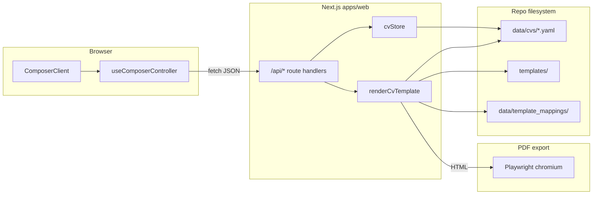

# Architecture Overview

## Monorepo layout

| Path | Role |
|------|------|
| `apps/web/` | Next.js 16 App Router — sole production UI and `/api/*` backend |
| `packages/schemas/` | `@muhfweeceevee/schemas` — CV JSON Schema + `validateCvV1()` |
| `packages/render-core/` | Placeholder package; **live rendering** is in `apps/web/src/lib/server/render/` |
| `packages/mcp-wrapper/` | stdio MCP server proxying HTTP API (`npm run mcp:api`) |
| `services/parser/` | FastAPI scaffold (`:8001`) — optional, not required for daily UI |
| `templates/` | Per-template `template.yaml`, `layout.yaml`, `license.yaml` + `catalog.yaml` |
| `data/cvs/` | CV YAML documents + `history/<cvId>/` snapshots on save |
| `data/template_mappings/` | One mapping file per template id (slot bindings) |
| `data/settings/` | OpenRouter YAML, company metadata JSON |
| `photos/` | Runtime photo gallery (gitignored) |
| `keywords/` | **Retired** — moved to `backup/retired-keywords/` (see packages reference) |
| `deploy/` | nginx + systemd unit examples |

**Package manager:** npm workspaces at repo root (`package.json` workspaces: `apps/*`, `packages/*`).

## Runtime resolution

`apps/web/src/lib/server/repoPaths.ts` walks up from `process.cwd()` until it finds
both `data/` and `templates/`. Works when cwd is repo root or `apps/web/`.

```typescript
repoPath("data", "cvs", `${cvId}.yaml`)
repoPath("templates", templateId, "template.yaml")
```

## End-to-end data flow



## UI entry points

| File | Purpose |
|------|---------|
| `apps/web/src/app/page.tsx` | Server page shell |
| `apps/web/src/app/ComposerClient.tsx` | `"use client"` — wires controller → shell |
| `apps/web/src/app/layout.tsx` | Root layout, fonts, global CSS |
| `apps/web/src/app/globals.css` | Design tokens (`--accent`, `--surface-*`, paper grid) |

## Active product surfaces (panels)

| Panel key | User label | Primary concern |
|-----------|------------|-----------------|
| `workspace` | Print Room | PDF preview, template/theme/photo mode, print tweaks |
| `photo_booth` | Photo Booth | Upload, AI analyze, compare, approve photo for export |
| `editor` | Editor | Form + YAML tabs, autosave, AI analysis, company targeting |
| `templates` | Templates | Catalog browse |
| `settings` | Settings | OpenRouter key, models, credit |

Companies / Keywords / Cover Letters tabs are planned or retired — do not assume routes exist without checking `apps/web/src/app/api/`.

## TypeScript paths

`apps/web/tsconfig.json`:

- `@/*` → `apps/web/src/*`
- `@muhfweeceevee/schemas` → `packages/schemas/src/index.ts`

## Version and stack

- Node `>= 22`, npm workspaces
- Next.js **16.1.6**, React **19**, Tailwind **4**
- Dev script forces **webpack** (not Turbopack) with polling for WSL `/mnt/c`
- PDF: **Playwright** headless Chromium in route handler (not parser service)

## Related reading

- Web UI detail: [`web-app-composer.md`](web-app-composer.md)
- API + stores: [`server-api-data.md`](server-api-data.md)
- Render: [`rendering-pipeline.md`](rendering-pipeline.md)